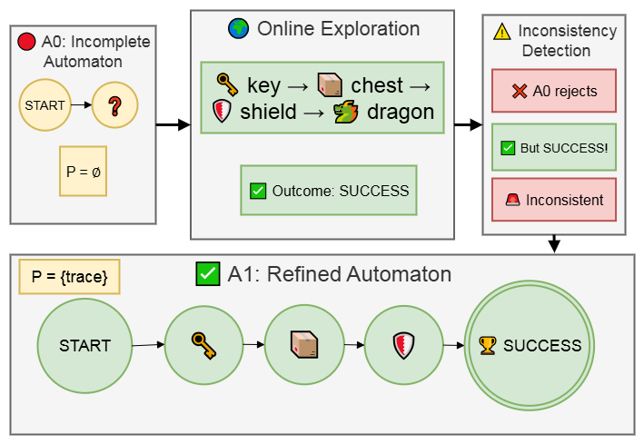
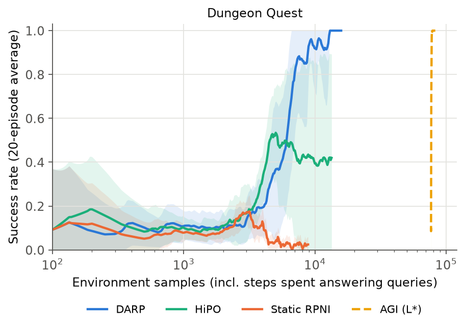
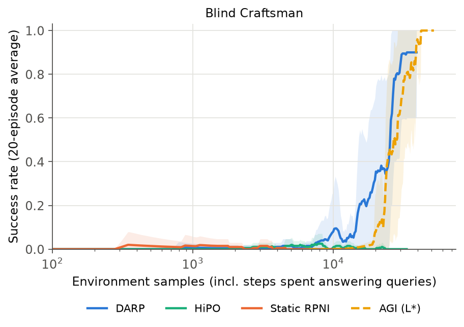

<div align="center">

# DARP: Dynamic Automaton Refinement and Planning

**Learn the task's automaton while you learn the policy, and fix it when reality disagrees.**

[](https://doi.org/10.1109/ICASSP55912.2026.11461556)
[](https://www.python.org/)
[](LICENSE)
[](https://github.com/mahyar333/DARP/actions/workflows/tests.yml)

Implementation of<br>
**[Dynamic Automaton Refinement and Planning for Non-Markovian RL](https://doi.org/10.1109/ICASSP55912.2026.11461556)**<br>
Mahyar Alinejad, Yue Wang, George Atia · *IEEE ICASSP 2026*

</div>

---

## Overview

In **non-Markovian** tasks the reward depends on the history. For example, *"get the key, open the chest
for the sword, pick up the shield, then face the dragon"* only pays off if the steps happened in a valid
order. Such tasks are naturally described by a **deterministic finite automaton (DFA)**. In practice,
though, the automaton is unknown, and the examples available up front are incomplete.

- **Passive** methods (RPNI, [HiPO](https://github.com/mahyar333/HiPO)) learn the automaton once from a
  fixed dataset and are stuck with its mistakes.
- **Active** methods (L\*) need an oracle that answers thousands of membership and equivalence queries.

**DARP** learns the automaton *online* from its own episodes and refines it whenever the evidence demands it:

<p align="center"></p>

1. **Confidence-weighted automaton learning.** RPNI infers a DFA from the positive and negative traces
   seen so far. Every automaton state carries a confidence score based on how much evidence supports it:

   $$c(q) = \frac{|P_q| + \lambda |N_q|}{|P_q| + |N_q| + \beta}$$

2. **Online refinement.** After each episode the observed outcome $y_t = R(w_t)$ is compared with the
   automaton's prediction. The trace is added to the training data and the automaton re-synthesised if
   there is an **inconsistency** ($\mathcal{A}_t(w_t) \neq y_t$) or a **coverage gap** (the run visits a
   state with $c(q) < \theta_{\min}$).
3. **Confidence-guided exploration.** A UCB-style bonus steers the agent toward rarely visited and
   poorly supported automaton states:

   $$\text{bonus}(s,a) = \alpha \sqrt{\frac{\log t}{N(q_\delta)}}\ \max\{1 - c(q_\delta), 0\}$$

4. **Incremental product-MDP updates.** After a refinement, Q-values of unchanged automaton states are
   kept. New states are initialised with the average over the old states at the same position, and
   changed states are reset to $\epsilon_{\text{init}}$.

## Environments

| | Dungeon Quest | Blind Craftsman |
|---|---|---|
| **Grid** | 7×7 | 7×7 with obstacles, 3 wood sources |
| **Goal** | reach the dragon holding the sword *and* the shield. The chest gives the sword only after the key. | go home with exactly 3 tools. At most 2 wood can be carried, and the factory turns all carried wood into tools. |
| **Valid patterns** | key→chest→shield, key→shield→chest, shield→key→chest | 1+1+1 (26 steps), 2+1 (20 steps), 1+2 (20 steps) |
| **Initial knowledge** | negatives only: DARP starts from **zero positive examples**; HiPO gets one pattern | DARP and HiPO both get **one pattern (1+1+1)** plus negatives |

The agent observes only its position. Entering a labelled cell emits an event, and the task outcome is a
function of the event trace. The agent never sees an inventory or hand-written rules.

**The Blind Craftsman scenario tests refinement directly.** RPNI generalises the single known pattern into
an automaton that also accepts wrong traces (e.g. visiting the factory three times without wood). A static
learner exploits the wrong automaton and never succeeds. DARP observes the failures, corrects the
automaton, and also discovers the shorter 2+1 and 1+2 strategies that the initial knowledge missed.

## Results

Reproduced with this code, 10 seeds per method (mean ± std). **Environment samples** count every step
taken in the environment, including the steps needed to execute the trajectories that AGI queries.

| Dungeon Quest | Blind Craftsman |
|:---:|:---:|
|  |  |

| Environment | Method | Env. samples to 90% success | Final success | New patterns discovered | Oracle queries |
|---|---|:---:|:---:|:---:|:---:|
| Dungeon Quest | **DARP** | **6,620 ± 1,201** | **100.0 ± 0.0%** | **1.2** | **0** |
| | HiPO | 5,486 ± 454 (only 4/10 runs) | 41.2 ± 46.8% | 0 | 0 |
| | Static RPNI | not reached | 2.0 ± 1.8% | 0 | 0 |
| | AGI (L\*) | 77,485 ± 46 | 100.0 ± 0.0% | 3.0 | 3,286 |
| Blind Craftsman | **DARP** | **23,694 ± 5,040** (9/10 runs) | **90.0 ± 30.0%** | **0.9** | **0** |
| | HiPO | not reached | 0.0 ± 0.0% | 0 | 0 |
| | Static RPNI | not reached | 0.0 ± 0.0% | 0 | 0 |
| | AGI (L\*) | 30,539 ± 6,205 | 100.0 ± 0.0% | 2.0 | 841 |

- **DARP learns the task from scratch.** In Dungeon Quest it starts with no positive example and still
  reaches 100% success in every run. The passive baselines never recover from their initial automaton.
- **Refinement fixes wrong automata.** In Blind Craftsman, HiPO and Static RPNI keep following an automaton
  that accepts invalid traces (0% success); DARP corrects it and succeeds in 9 of 10 runs.
- **It finds better strategies.** Successful DARP episodes take 12.9 steps in Dungeon Quest (optimal: 12),
  versus 21.5 for HiPO, which sticks to its one known pattern. In Blind Craftsman they take 22.6 steps,
  below the 26 of the known 1+1+1 pattern.
- **Fewer samples than active inference.** AGI (L\*) relies on the environment model and on membership
  and equivalence queries: 841–3,286 per run, costing 16k–77k environment steps to answer. DARP learns from
  its own episodes only and reaches 90% success with **11.7× fewer samples** in Dungeon Quest and
  **1.3× fewer** in Blind Craftsman.

Learning curves over episodes (`success_vs_episodes.png`) are also produced by `python -m darp.plot`.

### Ablation

Each component contributes (DARP with one component removed, 10 seeds):

| Variant | Dungeon Quest: episodes to 90% | Blind Craftsman: final success |
|---|:---:|:---:|
| **Full DARP** | **88** | **90%** |
| No exploration bonus | 106 | 80% |
| No Q-value transfer | 121 | 55% |
| No coverage-gap trigger | 102 | 60% |
| No refinement | not reached | 0% |

> These results were produced with this open-source version of the implementation, which includes some
> modifications (see [Implementation notes](#implementation-notes)); every method uses the same
> environments, rewards and seeds. Exact numbers are therefore not identical to the paper's tables, but
> they confirm the same findings.

## Installation

```bash
git clone https://github.com/mahyar333/DARP.git
cd DARP
python -m venv .venv && source .venv/bin/activate
pip install -e ".[dev]"
```

## Quickstart

```bash
# All methods (DARP, Static RPNI, HiPO, AGI) on Dungeon Quest, 10 seeds
python -m darp.run --config configs/dungeon_quest.yaml

# Only DARP and HiPO on Blind Craftsman, 3 seeds
python -m darp.run --config configs/blind_craftsman.yaml --methods darp hipo --seeds 0 1 2

# Learning curves
python -m darp.plot results/dungeon_quest

# Tests
pytest
```

Each run writes a per-episode log for every method and seed (`<method>_seed<k>.json`: success, steps,
refinements, automaton size, discovered patterns, oracle queries, environment samples, wall-clock time) and a
`summary.json`.

### Use it from Python

```python
from darp.agent import DARPAgent, DARPConfig
from darp.envs import make

env, task = make("dungeon_quest")
agent = DARPAgent(env, task, DARPConfig(), negatives=[("dragon",), ("shield", "dragon")])
for episode in range(300):
    success, trace = agent.run_episode()

print(agent.dfa)               # the current automaton
print(agent.patterns_known())  # valid patterns the automaton has discovered
```

## Configuration and hyperparameters

Experiments are defined in `configs/*.yaml`: environment, initial knowledge, shared Q-learning settings,
DARP's refinement and exploration settings, and the AGI baseline.

> **Note:** The learning hyperparameters in the public configs are **generic placeholders**. They run
> end to end and learn, but they are **not the tuned values** used for the results above. The tuned
> configurations are available on request.

## Implementation notes

- **RPNI** uses the standard red/blue state-merging formulation, so the automaton generalises beyond the
  prefix tree and always accepts every positive trace while rejecting every negative one.
- **Prefixes as evidence.** Every strict prefix of an observed trace received reward 0, so prefixes are
  added as negative examples. Without them, RPNI can learn an automaton whose start state already accepts.
- **Reward on the product MDP.** A goal reward on reaching an accepting state, a small step cost, and
  potential-based shaping with $\Phi(q) = -\text{dist}(q, F)$ (Ng et al., 1999). The shaping telescopes,
  so cycling through the automaton cannot collect reward. The same reward is used by DARP, HiPO and
  Static RPNI.
- **AGI** re-uses the reference L\* + QRM implementation of Topper et al. (ICAPS 2022), adapted to these
  environments, as in the [HiPO repository](https://github.com/mahyar333/HiPO).

## Repository structure

```
darp/
├── envs/
│   ├── gridworld.py     # labelled grid worlds with event traces (Dungeon Quest, Blind Craftsman)
│   └── tasks.py         # ground-truth rewards R(w) and valid-pattern definitions
├── automata/            # DFA and RPNI
├── confidence.py        # confidence scores c(q)
├── product.py           # state correspondence and Q-value transfer after a refinement
├── agent.py             # DARP (and the Static RPNI / HiPO baselines by switching components off)
├── baselines/agi.py     # L* active inference + value iteration + QRM
├── run.py               # CLI: python -m darp.run
└── plot.py              # CLI: python -m darp.plot
configs/                 # dungeon_quest.yaml, blind_craftsman.yaml
tests/
```

## Citation

```bibtex
@inproceedings{alinejad2026darp,
  title     = {Dynamic Automaton Refinement and Planning for Non-Markovian {RL}},
  author    = {Alinejad, Mahyar and Wang, Yue and Atia, George},
  booktitle = {IEEE International Conference on Acoustics, Speech and Signal Processing (ICASSP)},
  year      = {2026},
  doi       = {10.1109/ICASSP55912.2026.11461556}
}
```

## Acknowledgements

This work was supported by DARPA under Agreement No. HR0011-24-9-0427 and by NSF under Award CCF-2106339.
